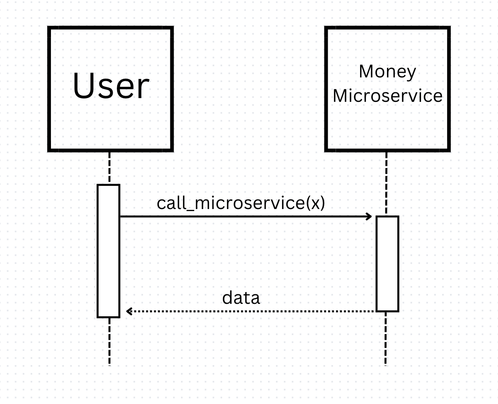

## Money Microservice 
### Communication Contract

Run each program in separate terminals via the commands "python money_microservice.py" and "python request_microservice.py"

**How to request data:**
Requests are made through the request_microservice.py file. The call_microservice function can be utilized to make a request to the microservice. A monetary value in the format of an integer, float or decimal with 2 deimal places are accepted as parameters. Strings may also be accepted as long as they can be converted to a float format. The call_microservice function can be called with the following line: call_microservice(value). This will write the value to the money-service.txt file, thus calling the microservice.
- Example Requests:
- call_microservice(12.20)
- call_microservice("30")

**How to receive data:**
Data is received from the microservice via the money-service.txt file. The call_microservice function reads that file and returns the data as a string. It also prints the data to the terminal. Thus, data is received by calling the microservice: data = call_microservice(value).

**UML Sequence Diagram:**

